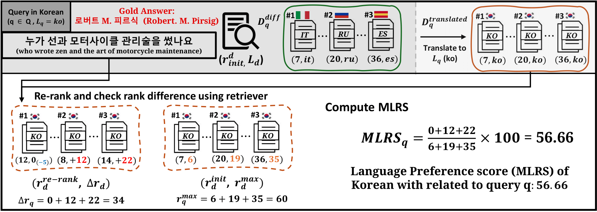

# Investigating Language Preference of Multilingual RAG Systems

Official Code Repository for the paper ["Investigating Language Preference of Multilingual RAG Systems"](https://arxiv.org/abs/2502.11175)

## Abstract
Multilingual Retrieval-Augmented Generation (mRAG) systems enhance language models by integrating external multilingual information to produce context-aware responses. However, mRAG systems struggle with retrieving relevant information due to linguistic variations between queries and documents, generating inconsistent responses when multilingual sources conflict. In this work, we systematically investigate language preferences in both retrieval and generation of mRAG through a series of experiments. Our analysis indicates that retrievers tend to prefer high-resource and query languages, yet this preference does not consistently improve generation performance. Moreover, we observe that generators prefer the query language or Latin scripts, leading to inconsistent outputs. To overcome these issues, we propose Dual Knowledge Multilingual RAG (DKM-RAG), a simple yet effective framework that fuses translated multilingual passages with complementary model knowledge. Empirical results demonstrate that DKM-RAG mitigates language preference in generation and enhances performance across diverse linguistic settings.



## Installation
The first step is to create a conda environment as follows:
```
conda create -n mrag python=3.10 ipykernel
conda activate mrag
pip install -r requirements.txt 
```

## Quick Start
Example of launching evaluation on the MKQA dataset in French, with retrieval from English Wikipedia:
```
python3 bergen.py generator='command-r-35b' retriever='bge-m3' reranker='bge-m3' dataset='mkqa/mkqa_fr.retrieve_en' prompt='basic_translated_langspec/fr'
```
For detailed instructions, please follow the official repository of our baseline [bergen](https://github.com/naver/bergen/blob/main/documentation/multilingual.md)
